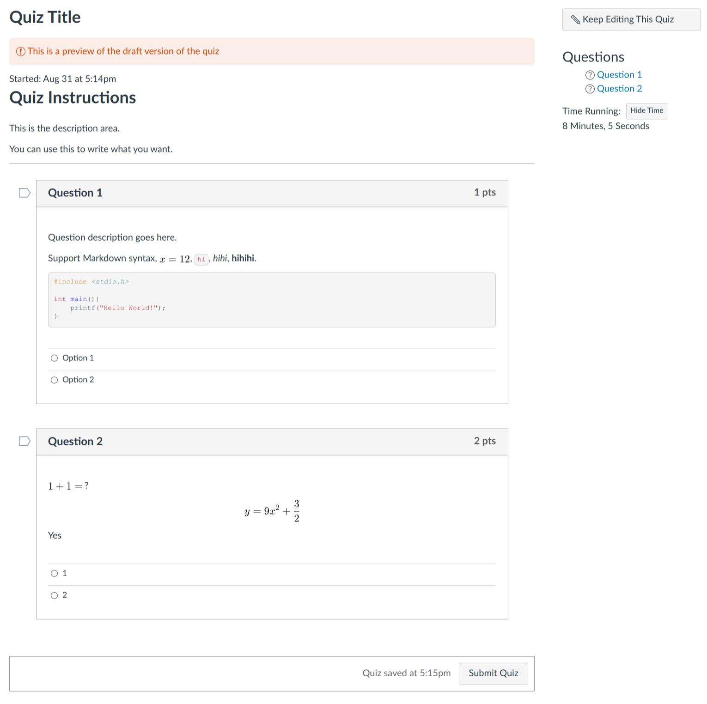

# Canvas-markdown-quiz

Add markdown support for Canvas LMS quizzes.

## Features

- Markdown parsing
- Latex Rendering (using [Upmath](https://upmath.me/) as backend)
- One markdown file per quiz

## Quick Start

### Markdown Writing

Following `test_quiz.md`, create your own quiz markdown file, like `quiz1.md`.

The structure of this md file should be like this:

```md
---
(Some quiz configs)
---

# Your Title

(Your description)

---

(Block 1)

---

(Block 2)

---

...

---

(Block n)
```

Quiz config should be formatted as YAML, and the options are available at [this page](https://canvas.instructure.com/doc/api/quizzes.html#method.quizzes/quizzes_api.create). You don't have to set title and description parameter in this config.

---

Each block is a question, and it should be like this:

````md

---

```yaml
question_type: multiple_choice_question
points_possible: 1
answers:
    -
        answer_text: "Option 1"
        answer_weight: 100
    -
        answer_text: "Option 2"
        answer_weight: 0
```

Question description goes here.

```cpp
#include <stdio.h>

int main(){
    printf("Hello World!");
}
```
---
````

Quiz question config should be formatted as YAML, and the options are available at [this page](https://canvas.instructure.com/doc/api/quiz_questions.html#method.quizzes/quiz_questions.create). You don't have to set the text parameter in this config.

### Installation

1. Install `canvas-markdown-quiz`

```sh
# using pip for python
pip install canvas-markdown-quiz

# using pip3 for python3
pip3 install canvas-markdown-quiz
```

Note: If you cannot install `canvasapi`, please check your network connection. We recommend you to use [Tsinghua mirror](https://mirrors.tuna.tsinghua.edu.cn/help/pypi/) in the mainland of China.

2. Run command

Open your project directory, and type the following command to run.

For the first time, it will ask you some questions to save the configuration file.

```sh
cvs-makequiz <md filename>
```

## Snapshot


